# Settings Sync 

> setting sync  是一个vs code 设置同步工具 它利用github当作托管的容器

## github上创建 gist

在 路径下 `Settings / Developer settings / Personal access tokens`   创建一个凭据

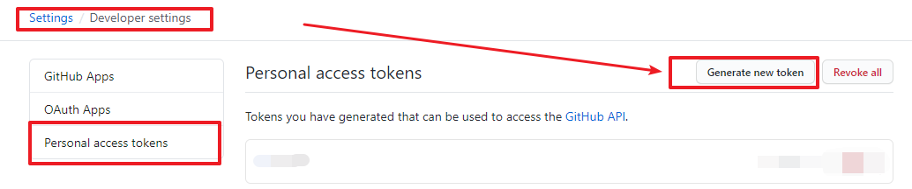

---

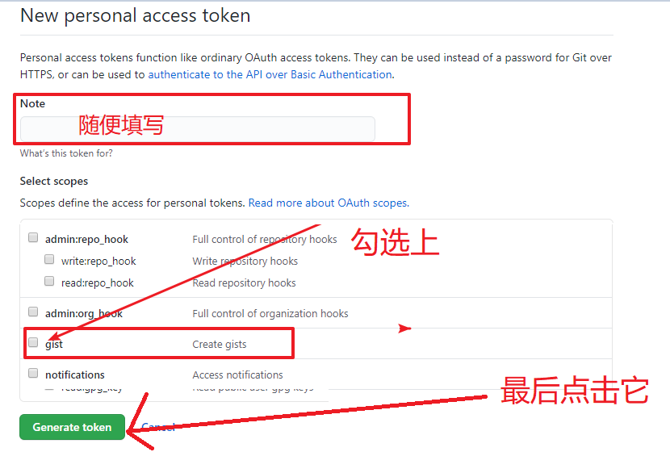

---

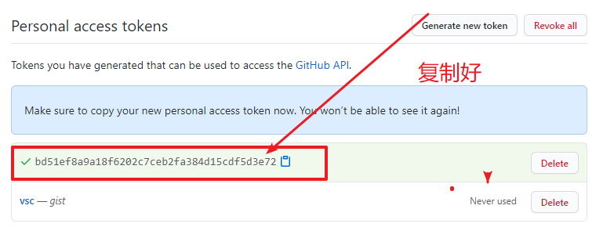

## vs code安装插件

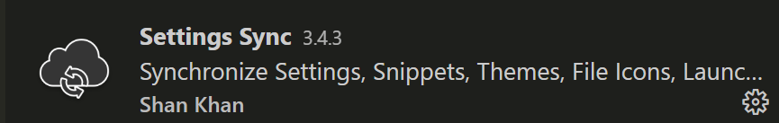

## 第一次上传 

1. `vs code` 中   按下  `ctrl + shift p`   

2. 输入  `reset`

   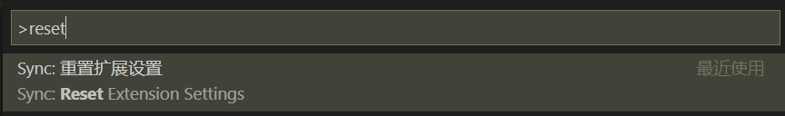

3. 再次按下 `ctrl + shift + p`

4. 输入 `upload`

   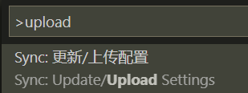

5. 点击 `login with github`

   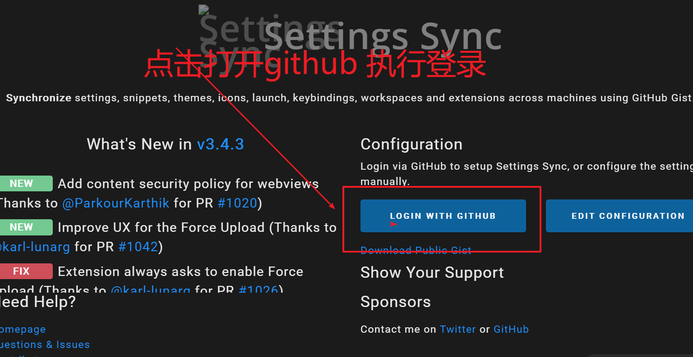

6. 浏览器上登录成功后 能看到如下效果

   

7. 回到 `vs code` 中  选择 我们最开始创建的 `gist`

   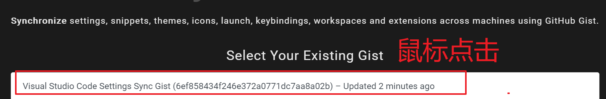

8. 点击 `关闭`

   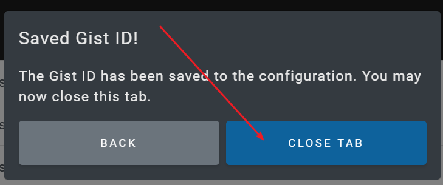

9. `vs code`   右下角 弹出提示 点击 `是`

   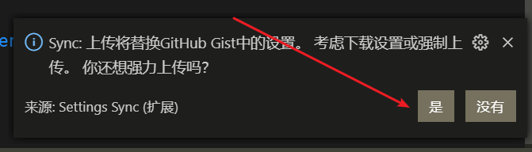

10. 后期上传的配置后 只要 按下 `ctrl + shift + p`     然后 输入 `upload` 即可上传

## 另外的电脑下载 vs code  配置

1. 在另外的电脑上重复  上面的步骤 直到  `步骤 9`     不选择任何 按钮 点击`关闭`

   

2. 输入 `ctrl + shift + p`  然后 输入 `download`  选择 `下的配置`

   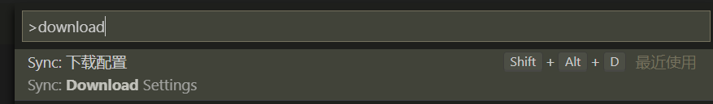

3. 等待片刻 大功告成

